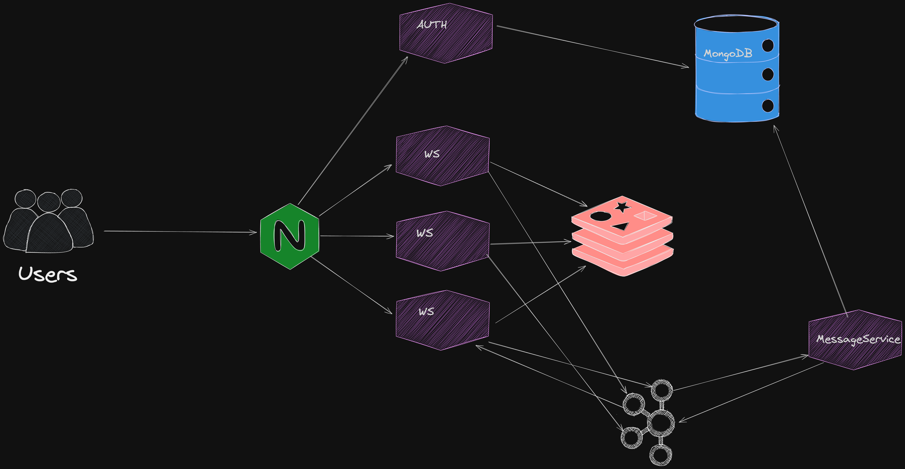

# Online Chat with Microservices and Event Sourcing

This project is an online chat application built with a microservices architecture and event sourcing principles. The system is designed with overengineering in mind to explore and implement advanced patterns and practices.

## Overview

The chat application consists of three primary services:

1. **WebSocket Service**: Handles client connections, receives messages, and broadcasts them to users in the group.
2. **Auth Service**: Responsible for user authentication and registration.
3. **Message Service**: Responsible for saving messages to MongoDB and sending saved messages back to the WebSocket service.

### Architecture

### Workflow

1. A client registers and logs in through the **Auth Service**.
2. The **Auth Service** issues a JWT token that the client uses for authentication with other services.
3. A client sends a message to the **WebSocket Service**.
4. The **WebSocket Service** sends the message through Kafka to the **Message Service**.
5. The **Message Service** saves the message to MongoDB.
6. After saving, the **Message Service** sends the saved message back to the **WebSocket Service**.
7. The **WebSocket Service** broadcasts the message to all users in the group.

## Technologies Used

- **Node.js**: The runtime environment for the services.
- **Kafka**: Used for messaging between services.
- **MongoDB**: The database for storing chat messages.
- **Socket.io**: For real-time communication between clients and the WebSocket service.
- **Redis**: For handling Socket.io's adapter for scaling across multiple servers.
- **JWT**: For secure token-based authentication.

## Services

### WebSocket Service

- **Handles client connections**: Manages user connections and disconnections.
- **Receives messages**: Accepts messages from connected clients.
- **Broadcasts messages**: Sends messages to all users in a specific group after processing.

### Auth Service

- **User Registration**: Allows users to create new accounts.
- **Authentication**: Issues JWT tokens upon successful login.
- **Token Verification**: Ensures that clients are authenticated before allowing access to other services.

### Message Service

- **Message Persistence**: Saves incoming chat messages to MongoDB.
- **Event Handling**: Listens for message events via Kafka and responds accordingly.

## Setup

To set up the project, follow these steps:

1. Clone the repository.
2. Install dependencies using `npm install`.
3. Set up the environment variables as required.
4. Start the services using `npm start`.

## Environment Variables

The following environment variables are required:

- `KAFKA_URL`: The Kafka broker URL.
- `MONGODB_URI`: The MongoDB connection string.
- `REDIS_URL`: The Redis connection string.
- `PORT`: The port for the WebSocket service.
- `JWT_SECRET`: The secret key for JWT authentication.
- `AUTH_SERVICE_URL`: The URL for the Auth Service.